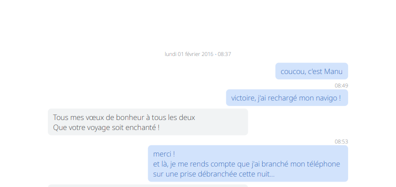

# sms

This is a tool build to extract data from sms & mms.

My input for data is an **xml backup** produced by the app ['SMS Backup & Restore' on Android](https://play.google.com/store/apps/details?id=com.riteshsahu.SMSBackupRestore).

You may need to adapt it to your use case.

## preparation

- run `yarn` to install dependencies

## xml → json

> input: **sms.xml** (your file)
- run: `yarn xml2json`

> output: **sms.json**

## json cleaning

> input: **sms.json** file

- copy `.env.sample` file into `.env` and fill it:
  - PHONE is (at least part) of the phone number of your correspondant you want to extract messages you exchanged with
  - LIMIT_SMS maximum number of sms to extract (leave empty to extract all)
  - LIMIT_MMS maximum number of mms to extract (leave empty to extract all)
  - USER_ME is how you want yourself to appear when you're the source of message (_ex:_ him)
  - USER_OTHER is how you want your correspondant (PHONE above) to appear when s·he is the source of a message (_ex:_ her)
  - DATE_FORMAT is used to format the date (using date-fns)
  - TIME_FORMAT is used to format the time (using date-fns)
  - LOCALE is also used to format the date & time  (using date-fns)
- run `yarn clean-json`

> ouput: **sms-clean.json**

The output is an ordered array (from oldest to newest) of [`Message`](./typings/Message.ts)

A message can be either a [`SMS`](./typings/SMS.ts) or a [`MMS`](./typings/MMS.ts):
```ts
[
  {
    type: 'SMS',
    timestamp: number,
    date: string, // cf. DATE_FORMAT and LOCALE above
    hour: string, // cf. TIME_FORMAT and LOCALE above
    source: string, // cf. USER_ME and USER_OTHER above
    message: string
  }, {
    type: 'MMS',
    timestamp: number,
    date: string, // cf. DATE_FORMAT and LOCALE above
    hour: string, // cf. TIME_FORMAT and LOCALE above
    source: string, // cf. USER_ME and USER_OTHER above
    message: {
      // all those are optional, but at least one will have a value
      text?: string,
      gif?: string,
      jpeg?: string,
      png?: string,
      audio?: string
    },
  }
]
```

## write pdf
> input: **sms-clean.json**

- the pdf configuration is in the `pdfConfig/` folder
  - `colors.ts` defines the colors of the speach bubbles for you and your correspondant
  - `generic.ts` contains some definition you shouldn't need to change (space & font sizes)
  - `pdf.ts` contains various generic definitions, the most important one being the size of the page (A4 here)Z
- run `yarn write-pdf`

> ouput: **sms.pdf**

The output is a pdf file
- the first page is a title page
- followed by an empty page
- and then the messages

Here are the rules to show some elements:
| element | position | rule |
|-|-|-|
| date · hour | horizontally centered | when a message is from a day different than the previous one |
| hour | far right (you) / far left (your correspondant) | when a message is from the same day than the previous one, but there's more than 2 min between them |

## example result



